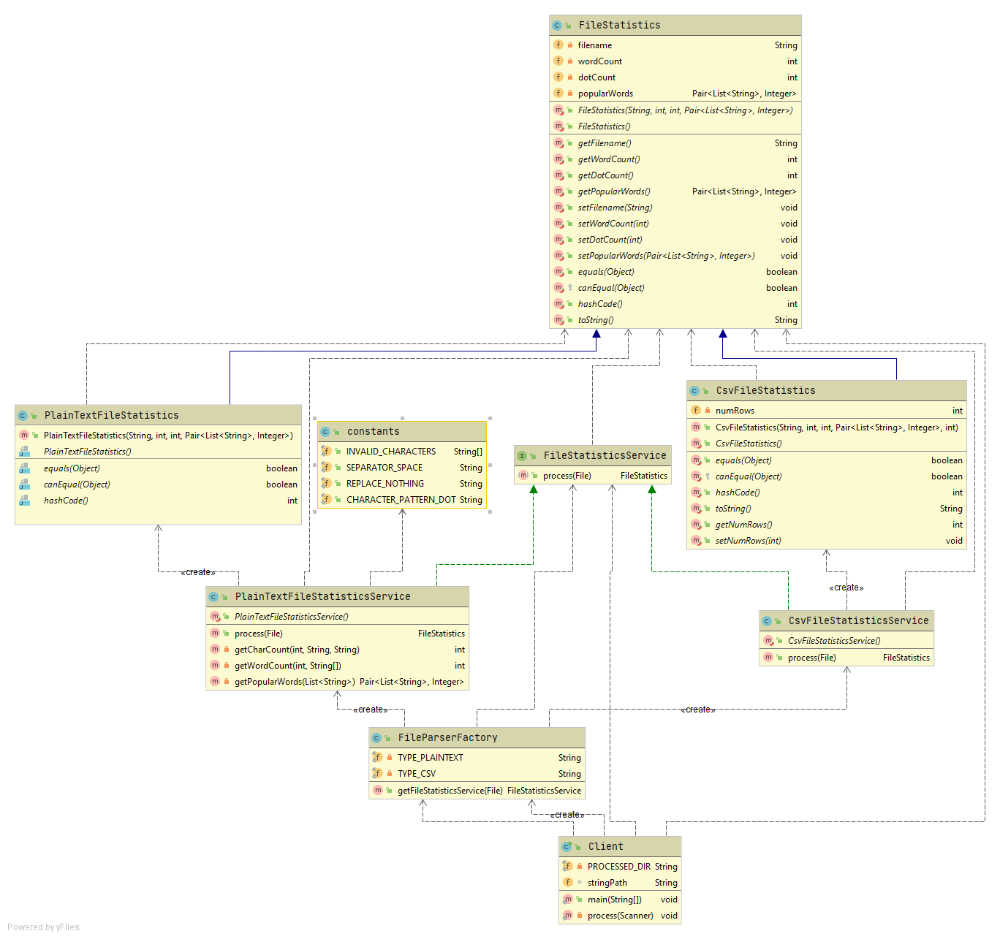

# Flat File Analyzer

### Project Description
Simple program to process and provide statistics to every valid files inside a directory inputted by user on console.
At the moment, only plaintext file format is catered as per requirement.

### To run
for mac:
- ./mvnw package
- java -jar target/flat-file-analyzer-0.1.0.jar

for windows, use ./mvnw.cmd# flat-file-analyzer
or you may simply run the main class inside your local IDE.

### UML Class Diagram

Client
- This class represents the client
- Invokes FileParserFactory that will provide specific FileStatisticsService implementation based on file format
- The process of finding the files is implemented by client because we do not want the api to require the client to follow
 a strict directory structure

FileParserFactory (Factory class)
- This class basically provides the available service parsers by the api
- It returns an instance of specific FileStatisticsService implementation
- If in the future, another parser service is added, say PDF file format, then client does not have to modify their existing code
but it will be the api that will create a new implementation of FileStatisticsService that will be responsible for parsing and processing PDF file format

FileStatisticsService (Contract)
- This establishes contract among specific implementations and with the client class
- Multiple parser services implements this service
- It has only one required method process() which produces an output of type FileStatistics

PlainTextFileStatisticsService (Implementation of FileStatisticsService)
- Implementation class of the contract specific for processing plain text files

CsvFileStatisticsService (Implementation of FileStatisticsService)
- Implementation class of the contract specific for processing csv text files

FileStatistics (Base class for statistics)
- Base class for the common statistics expected from any file format
- Unless explicitly provided by user requirement, additional statistics is recommended to be applied to specific children statistic class
so that future children statistics classes will not be required to implement statistics that they do not need

PlainTextFileStatistics (Child class of FileStatistics)
- Simple POJO to expose statistics expected from plain text file format

CsvFileStatisticsService (Child class of FileStatistics)
- Simple POJO to expose statistics expected from csv text file format

### For enhancement
- Given enough time, would suggest to log all action in a db with suggested columns:
id, filename, isSuccessful, trace, dateTimeCreated where <b>trace</b> is first 100 character of the exception stack trace when isSuccessful=0